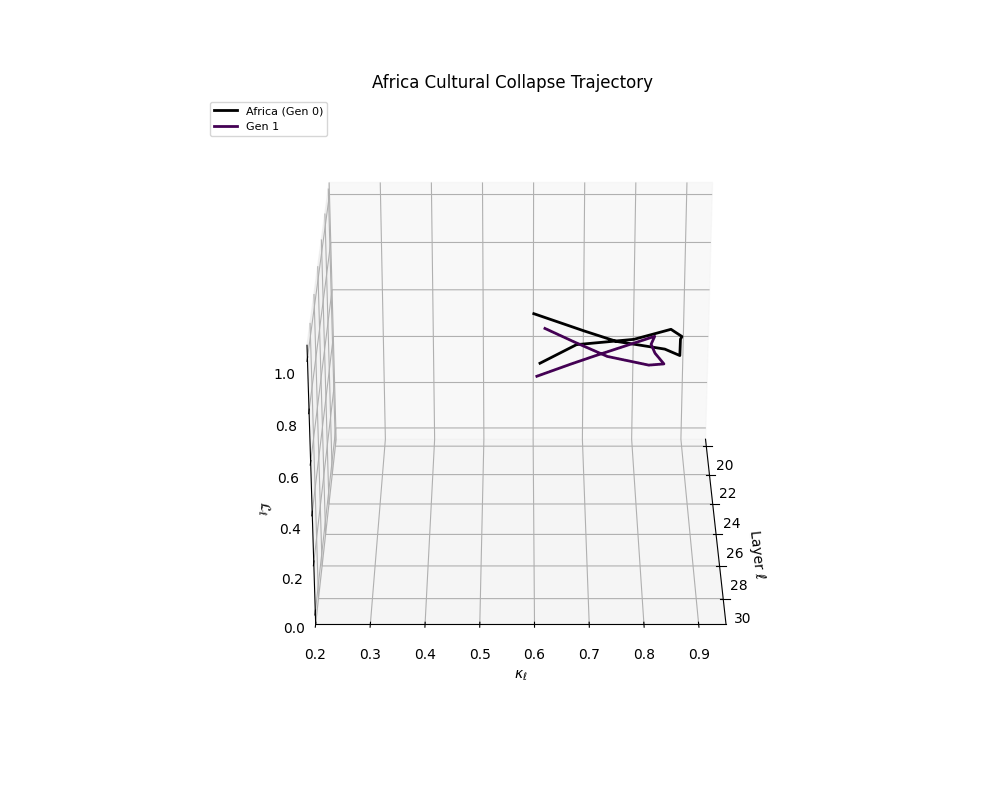
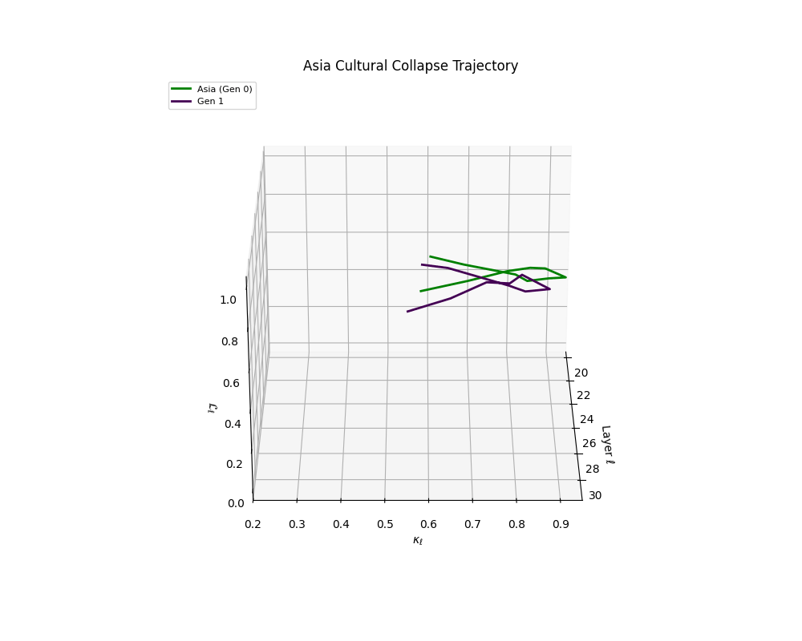
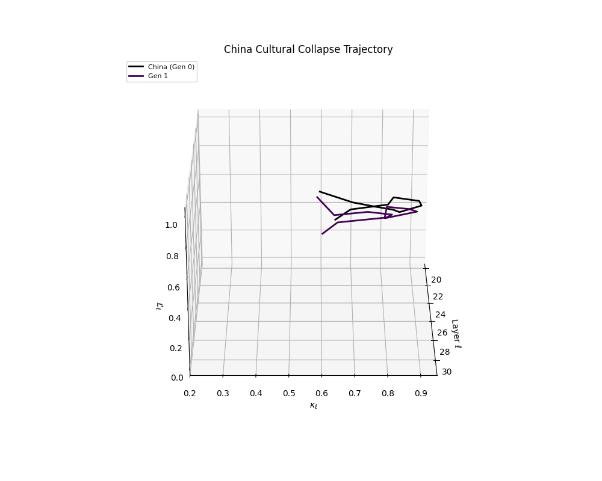
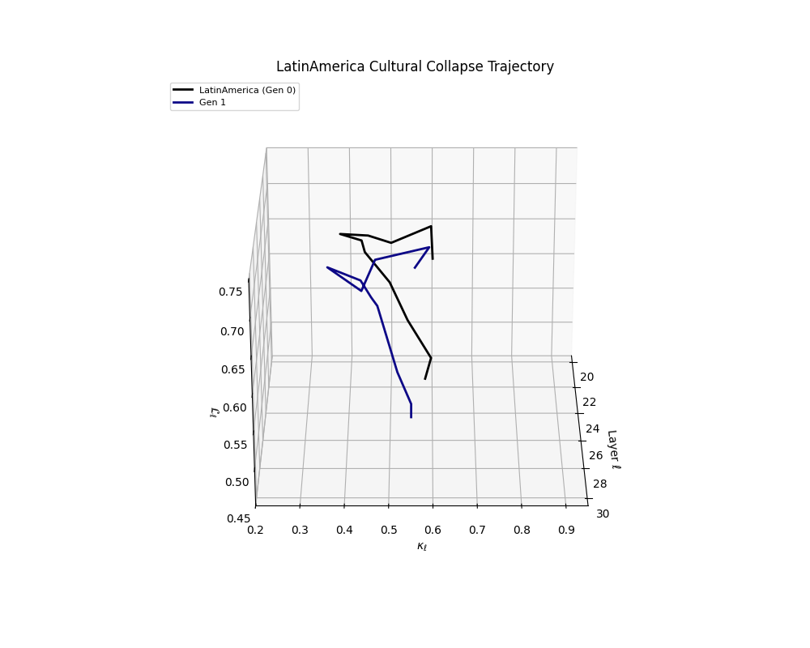
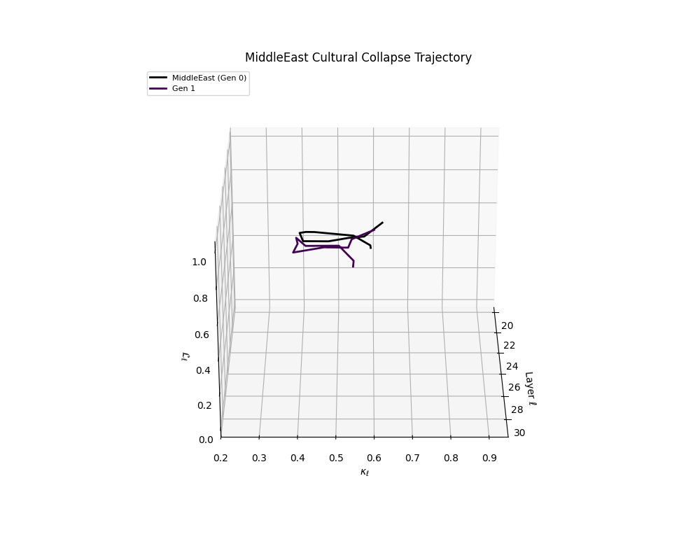
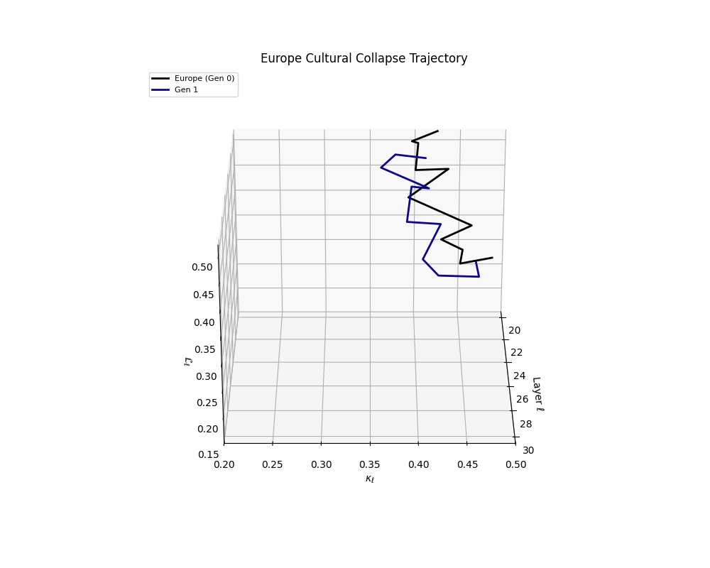
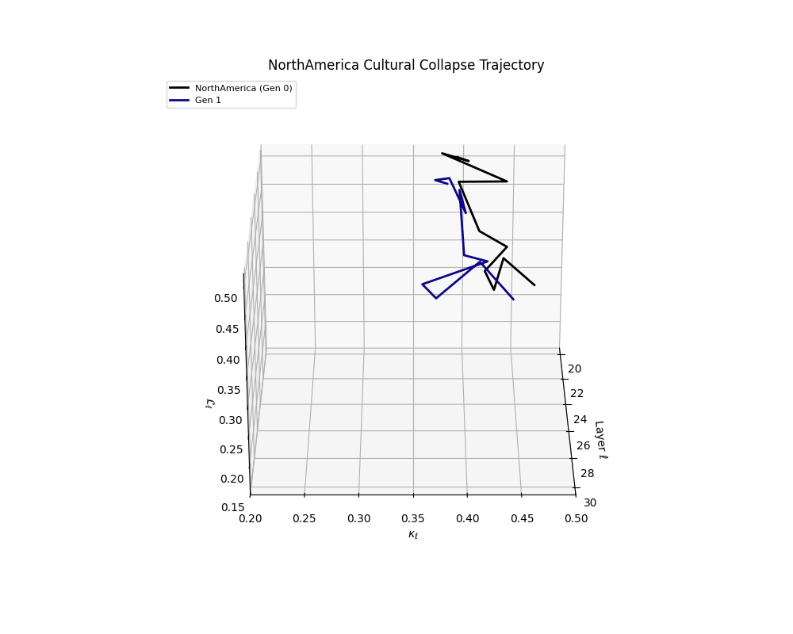
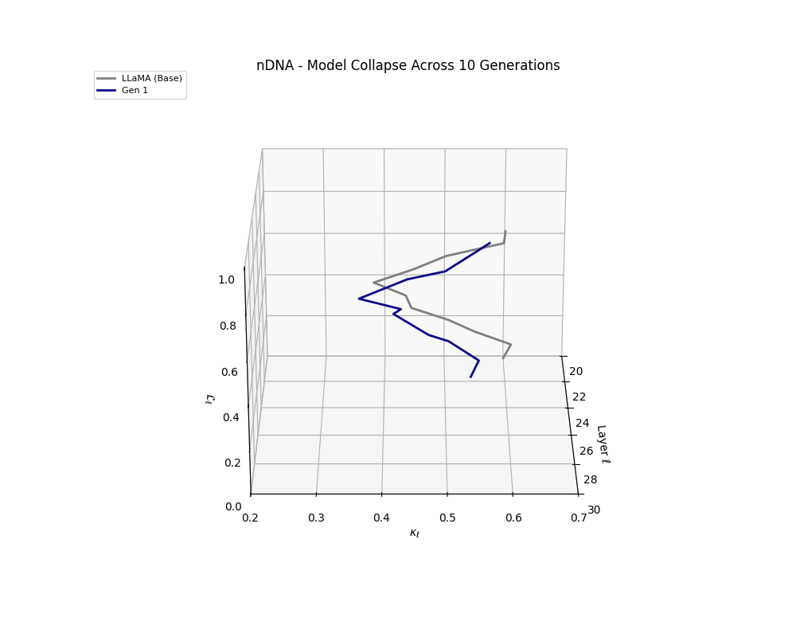
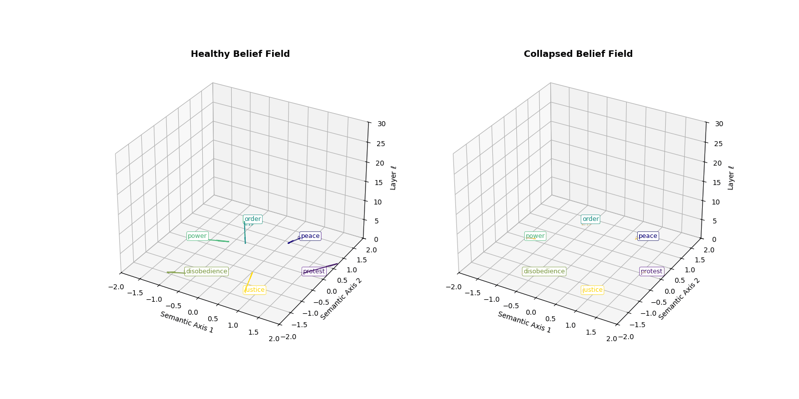

# Alignment

## Overview

**nDNA** provides quantitative methods for measuring and monitoring AI alignment, offering deep insights into how models internalize human values and behavioral constraints through three core metrics:

- **Spectral Curvature** \((\kappa_\ell)\): Behavioral instability and reasoning path deviations  
- **Thermodynamic Length** \((L_\ell)\): Computational effort required for value integration  
- **Belief Vector Strength**: Magnitude of alignment steering effects

---

## Cultural Models and DPO Alignment

### The LITMUS Dataset

Using 10,000 curated prompts (5,000 safe, 5,000 unsafe), Direct Preference Optimization (DPO) can be applied to culturally-specific models while preserving **regional identity**.

---

### Regional nDNA Signatures

#### High-Curvature Regions

**Africa**  
\[
\kappa_\ell: 0.85 \rightarrow 0.75, \quad L_\ell: 0.9 \rightarrow 0.8
\]  

**Asia**  
\(\kappa_\ell\) reduced by ~10%, smoothing epistemic manifolds  

**China**  
\[
\kappa_\ell: > 0.9 \rightarrow 0.8
\]  
Significant latent reorientation  

---

#### Moderate-Strain Regions

**Latin America**  
\[
\kappa_\ell: 0.7 \rightarrow 0.6
\]  

**Middle East**  
8–12% reduction in both \(\kappa_\ell\) and \(L_\ell\)  

---

#### Low-Strain Regions

**Europe**  
\[
\kappa_\ell: 0.4 - 0.5
\]  
Confirms alignment stability  

**North America**  
Remains within pretrained epistemic manifold  

**Australia**  
Minimal reconfiguration  
\[
\kappa_\ell: 0.42 - 0.55
\]  

---

#### Generic Models

**LLaMA**  
Moderate, stable alignment characteristics  

---

### Global Alignment Patterns

---

## DPO: Steering Without Understanding

nDNA shows that **Direct Preference Optimization (DPO)**:

- Does **not alter model knowledge**
- Applies **directional nudges** in activation space via:

\[
\textbf{Linear Logit Geometry:} \quad \text{Projection onto preference vectors}
\]  
\[
\textbf{Uniform Steering:} \quad \text{Global behavioral alignment via consistent shifts}
\]  
\[
\textbf{Symmetric Actuation:} \quad \text{Shallow translation without conceptual restructuring}
\]

---

## Alignment Detection

### Value Integration Patterns

Properly aligned models exhibit:

- **Stable Belief Vectors** — Directional consistency with human values  
- **Controlled Curvature** — Smooth representational changes avoiding harmful paths  
- **Balanced Thermodynamics** — Reasonable effort for ethical reasoning

---

### Misalignment Detection

**Early warning signs** of drift or deception:

- **Divergent Belief Vectors** — Misalignment with intended direction  
- **Anomalous Curvature** — Sharp transitions indicating brittle reasoning  
- **Thermodynamic Spikes** — High effort in ethically ambiguous queries

---

## Safety Applications

### Jailbreak Resistance

To detect/prevent adversarial bypass:

- Monitor belief vector stability under attacks  
- Flag curvature anomalies enabling jailbreaks  
- Track effort surges tied to unsafe outputs

---

### Alignment Faking Detection

To uncover **deceptive compliance**:

- Compare stated output vs internal belief vectors  
- Look for curvature inconsistencies  
- Analyze energy cost during ethical evaluations

---

### Null-Space Steering

Minimal-intervention safety fine-tuning:

\[
\Delta W = \Delta W_A + \Delta W_T
\]  
- \(\Delta W_A\): **Alignment-Critical** (tight safety regularization)  
- \(\Delta W_T\): **Task-Specific** (flexible, capability-oriented)

---

## RLHF and Constitutional AI

### RLHF Analysis

nDNA metrics show how **Reinforcement Learning from Human Feedback (RLHF)**:

- Reshapes latent value systems  
- Targets specific model layers  
- Evaluates long-term alignment retention

---

### Constitutional AI Signatures

Constitutionally guided models show:

- **Hierarchical Belief Structures** — Encoding tiered ethical frameworks  
- **Predictable Curvature Shifts** — Near sensitive moral boundaries  
- **Reduced Thermodynamic Variability** — Consistent ethical reasoning load

---

## Optimization Strategies

### Training Guidance

- Target optimal layers and epochs  
- Maintain tradeoff between alignment and performance  
- Avoid over-alignment or generalization loss

---

### Architecture Design

- Enable **stable belief propagation**  
- Promote **smooth curvature gradients**  
- Optimize for **thermodynamic efficiency** in value-aligned reasoning

---

## Future Directions

- **Real-time alignment monitors** in deployment  
- **Degradation predictors** for value drift  
- **Automated safety optimization pipelines**  
- **Cultural alignment preservation** in multi-lingual/cross-cultural settings

