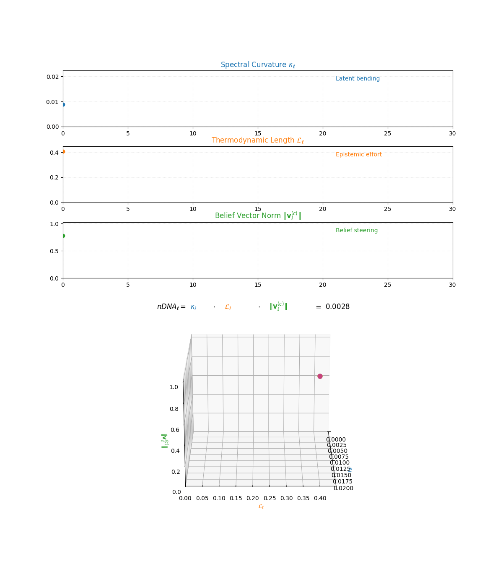
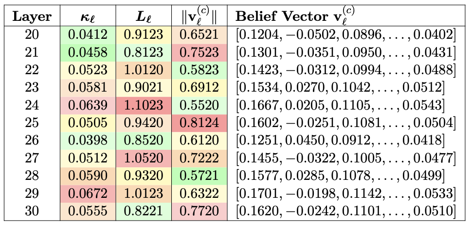

# nDNA

## Introduction to nDNA

**nDNA**—short for *Neural DNA*—is a semantic-genotypic representation that captures the latent identity of foundation models through the intrinsic geometry of belief. It is synthesized from three indispensable dimensions of latent geometry: spectral curvature, thermodynamic length, and belief vector fields. These dimensions converge to unveil an underlying epistemic cognitive geometry. The resulting structure is a high-dimensional scaffold of internal cognition—a latent topography called nDNA.

## What Qualifies as Heritability in Artificial Cognition?

Before we unveil **nDNA**, we must confront a foundational question: *What qualifies as heritability in artificial cognition*? Conventional artifacts—weights, activations, or output behavior—are mere epiphenomena of training. In contrast, nDNA seeks to capture a model’s **semantic genome**: the latent organizational structures that govern how knowledge is internally represented, adapted, and transmitted across fine-tuning, distillation, pruning, and deployment.

To chart the **semantic ancestry** of AI systems, we must move beyond output-level metrics and embrace a deeper epistemic foundation—one that traces not just *what* models say, but *how* they reason, evolve, and remember. We argue that **nDNA constitutes this missing genomic trace**: a structured latent fingerprint of artificial cognition.

Just as molecular genetics enabled biology to transcend surface taxonomies and uncover causal mechanisms, we contend that a **genomic lens is now essential for machine learning**—one that can quantify:

---

 <ul style="list-style-type: none; padding-left: 0;"> <li><b>✶ Layer Importance and Semantic Specialization:</b> Not all layers contribute equally to a model's epistemic structure. A growing body of evidence     reveals that semantic representations, cultural memory, and alignment behavior disproportionately concentrate in the mid-to-upper transformer layers—particularly the final 10 layers in 30-layer models. These layers encode more than surface patterns; they carry deep <em>semantic priors</em> and value shifts induced by alignment, fine-tuning, and cultural adaptation. For <em>nDNA</em> to serve as a meaningful genomic diagnostic, it must trace <em>inheritance</em>, <em>drift</em>, and <em>trait transformation</em> across these epistemically sensitive regions.</li>   <li><b>✶ Semantic Drift and Heritable Traits:</b> Subtle misalignments and persistent divergences—documented in alignment studies  —can occur even when models appear behaviorally consistent. These are not superficial perturbations but <em>inheritable epistemic traits</em> passed along neural offspring  .</li>   <li><b>✶ Value Simulation vs. Internalization:</b> As models grow more context-sensitive, they learn to <em>simulate</em> alignment without embodying its values  . Disentangling true normative internalization from strategic mimicry is essential for any meaningful epistemic inspection.</li>   <li><b>✶ Plasticity and Collapse:</b> Aggressive fine-tuning, distillation, or ideological merging can induce <em>plasticity collapse</em>—a reduction in epistemic flexibility and semantic richness  . This demands metrics that trace both robustness and degeneration over time.</li>   <li><b>✶ Latent Cultural Conflict:</b> In multilingual or cross-cultural settings, models often encode conflicting or incoherent value systems  . These conflicts are not visible through BLEU or ROUGE—they reside in the model’s <em>latent belief structure</em> and must be surfaced through <em>geometric lineage analysis</em>.</li>   <li><b>✶ Topological Continuity:</b> Alignment and fine-tuning <em>warp the internal geometry</em> of models in nontrivial ways  . <em>nDNA</em> must preserve continuity and interpretability of semantic trajectories across such transformations.</li>   <li><b>✶ Epistemic Mutation:</b> Merging preferences, annotator distributions, or learned behaviors—as explored by —creates emergent traits that standard metrics cannot track. These mutations are only diagnosable through a genomic lens on representation evolution.</li> </ul> 

---

## Why nDNA?

nDNA empowers us to interrogate the **hidden geometry of learning**—revealing how foundational operations such as alignment, fine-tuning, quantization, pruning, and multilingual fusion subtly but systematically reshape a model's **semantic core**.

It uncovers:
- Cultural instabilities from regional adaptation  
- Asymmetric inheritance across neural offspring  
- Latent reorganizations from merging or distillation  
- A model’s capacity to absorb or resist **conflicting epistemic pressures**

These phenomena—often dismissed as quirks—are in fact **heritable traits etched into the model’s internal manifold**. Viewed through this lens, **model collapse**, **alignment-induced drift**, and **semantic mimicry** become **structural signatures** of deeper latent dynamics.

## A Scientific Grammar for Cognition

nDNA transcends metaphor to become a **scientific grammar** for measuring:
- Epistemic resilience  
- Semantic coherence  
- Cultural consistency  
- Trait inheritance

It offers a **principled lens** through which to govern, understand, and audit the evolving anatomy of artificial cognition.

---

## Cultural Provenance and Layerwise Calibration

We further posit that **cultural provenance induces a distinct layerwise calibration effect**, predominantly in the final decoder layers $$\ell \in [20, 30]$$, where **sociolinguistic priors** exert the strongest influence on output distribution.

To capture this, we introduce the **nDNA Score**—a composite diagnostic unifying:

1. **Spectral Curvature** $$\kappa_\ell$$: Reflecting the **compression and warping of conceptual flow**  
2. **Thermodynamic Length** $$L_\ell$$: Quantifying the **epistemic effort** required for belief transitions  
3. **Belief Vector Field Norm** $$\|v^{(c)}_\ell\|$$: Measuring the **directional intensity of latent cultural drift**

Together, these form a **latent semantic fingerprint**—a high-dimensional, biologically inspired signature of internal cognition—enabling us to trace, compare, and govern the **neural evolution of foundation models** with unprecedented granularity.

## The Core Triad of nDNA

nDNA integrates three foundational signals to form a latent cognitive fingerprint. Each component captures a distinct dimension of semantic dynamics:

<h2>Spectral Curvature (κℓ)</h2>

  <h3>What is Spectral Curvature?</h3>
  
In classical geometry, <strong>curvature</strong> quantifies how much a path deviates from being straight—measuring the local bending of a trajectory.

  
In <strong>spectral geometry</strong> and <strong>harmonic analysis</strong>, curvature extends to how signals or paths behave in frequency space or under structure-encoding operators (e.g., Laplacians, difference operators). <strong>Spectral curvature</strong> refers to curvature derived through such operators—capturing the shape of latent signals as they evolve across layers of a model.

  <h3>Why Spectral Curvature for Latent Manifolds?</h3>
  
In foundation models, hidden representations form a sequence of activations:

  
$$\{ h_\ell \}_{\ell=0}^{L}$$

  
These activations trace a <strong>path in high-dimensional latent space</strong>, encoding the model's internal conceptual flow—how its beliefs evolve as it integrates priors, inputs, and alignment constraints.

  
<strong>Spectral operators</strong> (e.g., discrete Laplacians) naturally quantify how this path bends or accelerates. Unlike distance-based metrics, <strong>spectral curvature reflects intrinsic shape</strong>, invariant under reparameterization, making it ideal for probing internal geometry.

  <h3>Mathematical Formulation</h3>
  
Let the hidden activation at each layer be:

  
$$h_\ell \in \mathbb{R}^d$$

  
<strong>First-order difference:</strong>

  
$$\Delta h_\ell := h_\ell - h_{\ell-1}$$

  
This approximates <strong>local directional change</strong>—a discrete analogue of velocity in latent space.

  
<strong>Second-order difference (discrete curvature):</strong>

  
$$\Delta^2 h_\ell := \Delta h_{\ell+1} - \Delta h_\ell = h_{\ell+1} - 2h_\ell + h_{\ell-1}$$

  
This acts like a <strong>discrete Laplacian</strong> along the latent trajectory, highlighting where internal belief flow deviates from a straight path.

  
<strong>Spectral Curvature:</strong>

  
$$\kappa_\ell := \|\Delta^2 h_\ell\| = \|h_{\ell+1} - 2h_\ell + h_{\ell-1}\|$$

  
In the continuous case, this corresponds to:

  
$$\kappa(s) = \left\| \frac{d^2 h(s)}{ds^2} \right\|$$

  
where $$s$$ parameterizes depth through the network. The discrete $$\kappa_\ell$$ serves as a <strong>practical, layerwise estimator</strong> of curvature.

  <h3>Why Is This Meaningful?</h3>
  
<strong>Peaks in $$\kappa_\ell$$</strong> indicate layers where the model's <strong>internal geometry is most dynamic</strong>—zones of:

  <ul>
    <li>Semantic inflection</li>
    <li>Belief compression</li>
    <li>Ideological absorption</li>
  </ul>
  
These are <strong>structural signatures of epistemic adaptation</strong>, essential for tracing <strong>cultural inheritance</strong> and <strong>alignment-induced drift</strong> in foundation models.

  <h3>Lineage and Context</h3>
  
Spectral curvature draws on ideas from:

  <ul>
    <li><strong>Geometric deep learning</strong></li>
    <li><strong>Equivariant architectures</strong></li>
    <li><strong>Ricci flow in ML</strong></li>
    <li><strong>Spectral graph theory</strong>           </li>
    
  </ul>
  
Within the <strong>nDNA framework</strong>, spectral curvature functions as a <strong>principled geometric fingerprint</strong>, revealing not just <em>what</em> is encoded, but <em>how</em> internal belief pathways have been <strong>reshaped to encode it</strong>.

  <h3>Visualizing Spectral Curvature</h3>
  
<strong>Figure 1</strong> illustrates how spectral curvature:

  
$$\kappa_\ell := \|h_{\ell+1} - 2h_\ell + h_{\ell-1}\|$$

  
quantifies second-order deviations in latent representations across transformer layers. <strong>High curvature</strong> often emerges in <strong>upper decoder layers</strong>:

  
$$\ell \in [21, 30]$$

  
These layers are where models accommodate <strong>sociolinguistic priors</strong>, undergo <strong>multicultural or multilingual fusion</strong>, and reflect <strong>ideologically loaded or epistemically volatile regions</strong>.

  
Curvature in this context captures <strong>latent inheritance dynamics</strong>, serving as a <strong>fine-grained geometric fingerprint</strong> of internal restructuring and cultural adaptation.

<figure style="text-align: center; margin: 2em auto;">
  
  <figcaption style="margin-top: 12px; font-size: 0.9em; color: #555;">
    <strong>Figure:</strong> κℓ is typically elevated in upper decoder layers (ℓ ∈ [21, 30])—capturing sociolinguistic priors, multicultural fusion, and cultural adaptation.
  </figcaption>
</figure>

{% include wizuall.liquid
     image_path="introduction/spectral_curvature_llama_ndna_animation.gif"
     interactive_html="index/spectral_curvature_animation.html"
     title="Spectral Curvature (κ_ℓ)"
     caption="Spectral Curvature (κℓ) quantifies second-order deviations in latent representations across transformer layers–computed via the discrete geometric operator κℓ := ‖hℓ+1 − 2hℓ + hℓ−1‖ . High curvature signals semantic inflection points where internal geometry bends sharply–often in culturally dense, ideologically loaded, or epistemically volatile regions. Peaks in κℓ typically emerge in upper decoder layers (ℓ ∈ [21, 30]), where the model accommodates sociolinguistic priors during alignment, multicultural or multilingual fusion. Within the nDNA framework, such curvature reflects latent inheritance dynamics, offering a fine-grained geometric fingerprint of representational restructuring." %}

---

<h2>Thermodynamic Length (Lℓ)</h2>

  <h3>What is Thermodynamic Length?</h3>
  
In <strong>statistical thermodynamics</strong> and <strong>information geometry</strong>, <strong>thermodynamic length</strong> measures the <strong>cumulative effort—or work—required for a system to transition between states</strong> on a statistical manifold. It integrates local gradient energy along a trajectory, providing an <strong>intrinsic cost measure</strong> that is independent of parametrization.

  <h3>Why Thermodynamic Length for Foundation Models?</h3>
  
In foundation models, <strong>layers trace a path through latent belief space</strong>. As input data and alignment priors reshape activations, the model <strong>expends internal computational effort</strong> to adjust its belief state.

  
<strong>Thermodynamic length quantifies this latent effort</strong>—measuring not just <em>what</em> the model knows, but <strong>how hard it works</strong> to adapt that knowledge across layers in response to <strong>epistemic pressures</strong> such as:

  <ul>
    <li>Cultural fusion</li>
    <li>Alignment shifts</li>
    <li>Semantic restructuring</li>
  </ul>

  <h3>Mathematical Intuition</h3>
  
Let $$h_\ell$$ denote the latent state at layer $$\ell$$, and let $$\mathcal{M}$$ be the model's latent manifold. Layer transitions define a curve:

  
$$\gamma : [0, L] \to \mathcal{M}$$

  
The <strong>thermodynamic length</strong> of $$\gamma$$ is:

  
$$L(\gamma) = \int_0^L \sqrt{ \langle \dot{\gamma}(s), G_{\text{Fisher}} \, \dot{\gamma}(s) \rangle } \, ds$$

  
where $$G_{\text{Fisher}}$$ is the <strong>Fisher information metric</strong>. This integral represents the <strong>intrinsic work</strong> needed to traverse the belief trajectory $$\gamma$$ on $$\mathcal{M}$$.

  <h3>Interpretation</h3>
  
High <strong>thermodynamic length</strong> indicates <strong>regions where latent geometry stretches</strong>—where the model undergoes substantial <strong>reconfiguration</strong> to reconcile prior beliefs with new input.

  
Zones of high $$L_\ell$$ reveal:

  <ul>
    <li>Alignment tension</li>
    <li>Cultural fusion</li>
    <li>Complex reasoning</li>
    <li>Internal scaffold strain</li>
  </ul>
  
This offers a window onto the model's <strong>latent energy budget</strong>—how internal belief states reshape to meet complexity, constraint, and context.

  <h3>Discrete Formulation</h3>
  
Let $$p_\ell(y|x)$$ be the model's <strong>conditional distribution</strong> at layer $$\ell$$. The <strong>local epistemic cost</strong> is given by:

  
$$\|\nabla_\theta \log p_\ell(x)\|^2$$

  
This measures <strong>how much adjustment</strong> is needed locally at layer $$\ell$$ to better fit input $$x$$. Then, <strong>thermodynamic length</strong> at layer $$\ell$$ is:

  
$$L_\ell := \sum_{x \in D} \|\nabla_\theta \log p_\ell(x)\|^2 = |D| \cdot \mathbb{E}_{x \sim D} \|\nabla_\theta \log p_\ell(x)\|^2$$

  
This captures both the <strong>average local effort</strong> and how it <strong>scales with dataset size</strong>.

  <h3>Geometric Interpretation</h3>
  
In differential geometric terms, thermodynamic length can also be written as a <strong>path energy integral</strong>:

  
$$L_\ell = \int_{\gamma_\ell} \left\langle \frac{d h_\ell}{ds}, G_{\text{Fisher}}(h_\ell) \frac{d h_\ell}{ds} \right\rangle ds$$

  
where:

  <ul>
    <li>$$h_\ell$$ represents latent trajectories</li>
    <li>$$G_{\text{Fisher}}$$ is the Fisher information metric</li>
    <li>$$s$$ is arc length along $$\gamma_\ell$$</li>
  </ul>
  
This integral reflects <strong>how much internal "heat" or computational work</strong> is generated to reconcile the model's <strong>prior state with new input</strong> at layer $$\ell$$.

  <h3>Why Is This Meaningful?</h3>
  
Unlike static metrics like <strong>weight magnitudes</strong>, $$L_\ell$$ is <strong>dynamically grounded</strong>. It reveals where the model <strong>actively strains</strong> to reconcile <strong>competing epistemic demands</strong>.

  
High $$L_\ell$$ signals:

  <ul>
    <li>Internal resistance</li>
    <li>Belief restructuring</li>
    <li>Compression under tension</li>
    <li>Response to multilingual or cultural shifts</li>
  </ul>

  <h3>Lineage and Context</h3>
  
This diagnostic builds on:

  <ul>
    <li>The <strong>Fisher–Rao metric</strong> in information geometry</li>
    <li><strong>Thermodynamic length</strong> formalism from statistical physics     </li>
    
  </ul>
  
Within the <strong>nDNA framework</strong>, thermodynamic length complements <strong>spectral curvature</strong>: while curvature reveals <em>where</em> the model bends, $$L_\ell$$ shows <strong>how hard it works</strong> to do so.

  
Together, these axes form a <strong>neurogeometric anatomy</strong> of latent belief adaptation.

  <h3>Visualizing Thermodynamic Length</h3>
  
<strong>Figure 2</strong> shows thermodynamic length:

  
$$L_\ell := \sum_{x \in D} \|\nabla_\theta \log p_\ell(x)\|^2$$

  
It quantifies <strong>epistemic work</strong> across transformer layers—computed as the <strong>cumulative squared gradient norm</strong> of layerwise log-likelihoods.

  
Peaks in $$L_\ell$$ highlight:

  <ul>
    <li><strong>Belief compression</strong></li>
    <li><strong>Alignment restructuring</strong></li>
    <li><strong>Negotiation of conflicting priors</strong></li>
  </ul>
  
In culturally fine-tuned models, these peaks typically <strong>localize to upper decoder layers</strong>, where <strong>intense adaptation</strong> occurs near output-generating blocks.

  
Within <strong>nDNA</strong>, this metric <strong>reveals latent epistemic effort</strong>—providing a nuanced view of <strong>how and where</strong> models allocate internal resources during learning and inference.



---

<h2>Belief Vector Field (||v(c)ℓ||)</h2>

  <h3>What is the Belief Vector Field?</h3>
  
In differential geometry and physics, a <strong>vector field</strong> describes a directional force applied at each point of a space. Inspired by this, the <strong>Belief Vector Field</strong> models the <strong>directional semantic force</strong> that a specific culture or value system exerts on a model's latent representations.

  
It encodes <strong>where</strong>, <strong>how strongly</strong>, and <strong>in what direction</strong> cultural priors act within the model's internal geometry—functioning as a <strong>semantic compass</strong> through the latent manifold.

  <h3>Why a Vector Field for Cultural Influence?</h3>
  
While <strong>spectral curvature</strong> $$\kappa_\ell$$ captures how sharply latent paths bend, and <strong>thermodynamic length</strong> $$L_\ell$$ captures how hard the model works during adaptation, <strong>neither reveals the source, direction, or origin</strong> of that adaptation.

  
The <strong>Belief Vector Field</strong> offers this missing piece: it traces the <strong>latent steering</strong> (aka torsion) applied by culture-conditioned priors—<strong>where</strong> the model is being pushed in latent space, by <strong>what epistemic force</strong>, and <strong>toward which semantic direction</strong>.

  
This makes it a critical diagnostic for studying:

  <ul>
    <li>Cultural drift</li>
    <li>Ideological imprinting</li>
    <li>Alignment tension</li>
  </ul>

  <h3>Visualization</h3>
  
<strong>Figure 3: Belief Vector Field Visualization</strong>

  
$$v^{(c)}_\ell = \mathbb{E}_{x \sim P^{(c)}_{\text{CIVIC}}} \left[ \nabla_{h_\ell} \log p(y | x) \right]$$

  
This represents the <strong>belief semantic steering force</strong> at layer $$\ell$$ toward concept $$c$$, conditioned on CIVIC cultural priors (cf. Sec. 6).

  <ul>
    <li>Large magnitudes $$\| v^{(c)}_\ell \| \in [0.15, 0.50]$$ indicate <strong>strong directional pressure</strong>—zones where cultural values actively <strong>reshape latent geometry</strong>.</li>
    <li>Color-coded arrows trace <strong>distinct conceptual trajectories</strong> (<em>protest, peace, order, power, disobedience, justice</em>).</li>
    <li>Numeric labels quantify <strong>local steering strength</strong>.</li>
  </ul>
  
Upper layers $$\ell \geq 20$$ typically exhibit <strong>epistemic reorientation</strong>, where cultural priors most heavily influence belief encoding.

  
Such visualizations reveal whether a model <strong>internalizes culturally contingent reasoning</strong> or merely mimics alignment at the <strong>output surface</strong>.

  <h3>Mathematical Formulation</h3>
  
Let $$p(y \mid x)$$ denote the model's conditional output distribution for input $$x$$, and let $$h_\ell$$ be the latent representation at layer $$\ell$$.

  
The <strong>local belief gradient</strong> is:

  
$$\nabla_{h_\ell} \log p(y \mid x)$$

  
This measures how a small change in $$h_\ell$$ would affect output confidence—a <strong>proxy for semantic force</strong> at that layer.

  
To extract the culturally conditioned semantic force, we compute its expectation over a culture-specific distribution $$P^{(c)}$$:

  
<strong>Belief Vector Field at layer $$\ell$$:</strong>

  
$$v^{(c)}_\ell := \mathbb{E}_{x \sim P^{(c)}} \left[ \nabla_{h_\ell} \log p(y \mid x) \right]$$

  
Here, $$P^{(c)}$$ represents inputs <strong>emblematic of a given manifold condition</strong> $$c$$ (e.g., regional, linguistic, or ideological contexts).

  
This formulation captures <strong>not just latent deformation, but its cause</strong>: how <strong>cultural priors exert directional influence</strong> within the belief manifold.

  <h3>Why is This Meaningful?</h3>
  
The vector field $$v^{(c)}_\ell$$ provides a <strong>directional lens on latent dynamics</strong>.

  <ul>
    <li>High $$\| v^{(c)}_\ell \|$$: regions where the model is actively <strong>redirected by external cultural forces</strong></li>
    <li>Offers diagnostic power for detecting:
      <ul>
        <li>Ideological drift</li>
        <li>Semantic conflict</li>
        <li>Bias inheritance</li>
      </ul>
    </li>
  </ul>
  
Unlike $$\kappa_\ell$$ or $$L_\ell$$, which capture <strong>internal geometry</strong>, $$v^{(c)}_\ell$$ reveals <strong>external epistemic pressure</strong> and its <strong>directional impact</strong>.

  <h3>Lineage and Context</h3>
  
This diagnostic builds upon:

  <ul>
    <li><strong>Belief geometry</strong></li>
    <li><strong>Alignment drift studies</strong></li>
    <li><strong>Cultural bias tracing in NLP</strong>           </li>
    

  </ul>
  
Within the <strong>nDNA framework</strong>, it integrates with <strong>curvature</strong> and <strong>length</strong> to offer a <strong>holistic neurogeometric portrait</strong>—revealing:

  <ul>
    <li>How models <strong>inherit</strong> beliefs</li>
    <li>Where they <strong>adapt</strong> under cultural force</li>
    <li>When they <strong>distort</strong> or <strong>realign</strong> due to ideological influence</li>
  </ul>

  <h3>Interpretability in Practice</h3>
  
By mapping $$v^{(c)}_\ell$$ across <strong>layers</strong> and <strong>cultures</strong>, we can:

  <ul>
    <li>Trace <strong>cultural provenance</strong></li>
    <li>Identify <strong>ideological pressure zones</strong></li>
    <li>Diagnose <strong>inheritance asymmetry</strong> in <strong>multilingual</strong> or <strong>aligned models</strong></li>
  </ul>
  
This <strong>directional fingerprint</strong> informs audits of:

  <ul>
    <li>Model bias</li>
    <li>Robustness</li>
    <li>Alignment integrity</li>
  </ul>
  
It provides the <strong>missing vectorial dimension</strong> in understanding machine cognition.



---

<h2>nDNA Score</h2>

  <h3>Why a unified score?</h3>
  
While spectral curvature ($$\kappa_\ell$$), thermodynamic length ($$L_\ell$$), and the belief vector field norm ($$\|v^{(c)}_\ell\|$$) each offer unique insight into latent dynamics, they operate on distinct facets of epistemic geometry.

  
The <strong>nDNA score</strong> is a cumulative measure of latent geometry, quantifying how a large language model adapts its internal scaffolding to a given corpus. It integrates three key components at each layer $$\ell$$:

  <ul>
    <li><strong>Curvature ($$\kappa_\ell$$):</strong> how twisted or bent the latent manifold is; captures how sharply internal trajectories bend — a scalar measure of latent acceleration.</li>
    <li><strong>Length ($$L_\ell$$):</strong> how much latent work or displacement occurs as representations evolve; quantifies how hard the model works to adapt its beliefs — a scalar effort integral.</li>
    <li><strong>Belief vector norm ($$\|v^{(c)}_\ell\|$$):</strong> how strong the model's belief signal is for that corpus; encodes where and how strongly cultural priors steer latent space — a scalar magnitude derived from the vector field.</li>
  </ul>

  <h3>Formal Definition</h3>
  
The <strong>nDNA score</strong> is defined as:

  
$$\text{nDNA} := \sum_{\ell=1}^L \omega_\ell \cdot \kappa_\ell \cdot L_\ell \cdot \|v^{(c)}_\ell\|$$

  
where:

  <ul>
    <li>$$\omega_\ell$$ is the layer weight to emphasize semantically expressive or epistemically significant layers (e.g., decoder tops),</li>
    <li>$$\kappa_\ell$$ is spectral curvature,</li>
    <li>$$L_\ell$$ is thermodynamic length,</li>
    <li>$$\|v^{(c)}_\ell\|$$ is the magnitude of the belief vector field conditioned on culture $$c$$.</li>
  </ul>

  <h3>Why multiply these?</h3>
  
Individually, the terms illuminate:

  <ul>
    <li><strong>Latent strain</strong> ($$\kappa_\ell$$),</li>
    <li><strong>Adaptation cost</strong> ($$L_\ell$$),</li>
    <li><strong>Cultural pressure</strong> ($$\|v^{(c)}_\ell\|$$).</li>
  </ul>
  
Together, their <strong>product</strong> gives a unified diagnostic of <strong>latent reconfiguration</strong> — indicating where internal bending, belief effort, and epistemic steering all co-occur.

  
The weight $$\omega_\ell$$ can be:

  <ul>
    <li>Uniform across layers,</li>
    <li>Hand-tuned based on epistemic depth,</li>
    <li>Optimized via alignment or interpretability objectives.</li>
  </ul>

  <h3>Interpretability & Practical Use</h3>
  
The <strong>nDNA score</strong> enables:

  <ul>
    <li>Comparison of parent vs. child models (fine-tuning, distillation, merging),</li>
    <li>Detection of <strong>semantic mutation</strong>, <strong>ideological drift</strong>, or <strong>inheritance asymmetry</strong>,</li>
    <li>Quantification of <strong>latent epistemic integrity</strong> — the hidden cost and directionality of adaptation.</li>
  </ul>

  <h3>Conviction</h3>
  
By unifying spectral ($$\kappa_\ell$$), thermodynamic ($$L_\ell$$), and vectorial ($$\|v^{(c)}_\ell\|$$) diagnostics, the <strong>nDNA score</strong> acts as a <strong>heritable geometry index</strong>, diagnosing how <strong>latent traits persist, mutate, or degrade</strong> as foundation models evolve.

<figure style="text-align: center; margin: 2em auto;">
  
  <figcaption style="margin-top: 12px; font-size: 0.9em; color: #555;">
    <strong>Figure:</strong> The nDNA score unifies spectral curvature (κℓ), thermodynamic length (Lℓ), and belief vector field magnitude (||v(c)ℓ||) to create a heritable geometry index that diagnoses how latent traits persist, mutate, or degrade as foundation models evolve.
  </figcaption>
</figure>

---

<h2>nDNA Geometry</h2>

  <h3>The Foundation of nDNA</h3>
  
The notion of <strong>nDNA</strong> arises from a simple yet profound insight: modern foundation models do not merely produce outputs—they embody a <strong>latent cognitive structure</strong> that governs how they reason, adapt, and evolve (7; 48). This latent structure is not directly encoded in model weights or activations alone; rather, it emerges in the internal geometry of belief formation, semantic flow, and epistemic adaptation across layers (24; 41).

  
We define the <strong>nDNA geometry</strong> of a model as the joint distribution of its spectral curvature ($$\kappa_\ell$$), thermodynamic length ($$L_\ell$$), and belief vector field norm ($$\|v^{(c)}_\ell\|$$) layer-by-layer. This triad forms a high-dimensional semantic fingerprint that encodes a model's inheritance stability, alignment dynamics, and cultural drift—analogous to how biological DNA records heritable traits and mutations (32; 47).

  <h3>Table 1: Illustrative nDNA Example</h3>
  <figure style="text-align: center; margin: 1em 0;">
    
  </figure>

  <h3>Interpreting the nDNA Pattern</h3>
  
Table 1 provides an illustrative example of nDNA geometry, highlighting how these quantities vary across depth in a representative model. Rather than simple monotonic trends, we observe intricate layer-wise patterns:

  <ul>
    <li>Certain layers exhibit elevated curvature ($$\kappa_\ell > 0.06$$), signaling sharp latent reorientation (34),</li>
    <li>Others concentrate thermodynamic length ($$L_\ell > 1.10$$), reflecting zones of intense internal work to reconcile competing priors (43; 44),</li>
    <li>The belief vector norm ($$\|v^{(c)}_\ell\|$$) exposes the directional cultural force acting on the latent manifold (5; 49), marking layers where external alignment or sociolinguistic conditioning exerts greatest influence.</li>
  </ul>
  
Together, these values form a geometry-specific trace that distinguishes models by their latent adaptation history.

---

# The Corpus Dependence of nDNA: A Necessary Feature, Not a Flaw
 

In biological systems, DNA is celebrated as the universal code of life—a sequence of nucleotides that, across all known organisms, governs the development, function, and inheritance of traits (54; 55). Yet despite this universal structure, the functional expression of DNA is profoundly context-dependent.

The same genome, when expressed in different cellular contexts, gives rise to vastly different phenotypes: for instance, neurons and hepatocytes arise from identical genetic material yet serve radically different functions (56; 57). This context-sensitive expression is orchestrated through layered regulatory mechanisms, including epigenetic modifications (56), transcription factor (TF) binding (58), and chromatin architecture remodeling (59; 60). These mechanisms form a hierarchical, probabilistic regulatory network that determines gene expression patterns in response to developmental and environmental cues (61).

Figure 5 illustrates a hierarchical regulatory framework where universal DNA undergoes epigenetic modifications and context-specific transcription factor actions to produce specialized gene expression programs. Analogously, in large language models, this layered structure parallels nDNA latent scaffolding that encodes both universal priors and task-dependent adaptations, enabling coherent, flexible, and robust functional diversity across domains.

Similarly, in large foundation models, the neural DNA (nDNA)—a composite measure of latent geometry encompassing spectral curvature ($$\kappa$$) (66), thermodynamic length ($$L$$) (67), and latent belief vector norms (63)—exhibits both universal structure and corpus-specific adaptation.

LLMs encode universal latent priors through pretraining: architectural invariances (68), semantic manifolds (69; 70), and attention-based relational structures (64). However, when probed with different corpora such as mathematical reasoning benchmarks (e.g., GSM8K (71)), dialogue datasets (e.g., MultiWOZ (72)), or encyclopedic QA (e.g., SQuAD (73)), the model activates distinct latent scaffolding, producing task-specific geometric pathways.

In both systems, structured variation emerges as a necessity: in biology, to produce functional diversity across cell types; in LLMs, to scaffold reasoning across tasks while maintaining alignment and generalization (70; 71). Like tissue-specific gene expression, corpus-dependent nDNA scaffolding follows precise, learned priors rather than arbitrary variation. Mathematical models of both systems reduce to path integrals over conditional cost:

$$
S(c) = \int_{\gamma_c} C(h_\ell; c) \, ds
$$

where $$\gamma_c$$ is the pathway for context $$c$$ (cell type or corpus), and $$C$$ reflects regulatory or loss cost.

Where DNA differentiates cells, nDNA differentiates reasoning. Both systems achieve functional coherence through context-dependent geometry anchored in universal code.

Despite their contextual variation, both DNA and nDNA encode universal structure that stabilizes functional diversity. In biology, this universality is embodied in the genetic code: the shared language of codons, conserved regulatory motifs, and chromatin architectural principles that ensure coherent development across tissues (54; 55). In large language models, nDNA's universality arises from the shared latent priors learned during pretraining: attention-based relational structures (68), semantic manifolds (69), and transformer-invariant latent symmetries (70).

These priors act as the “genomic grammar” that binds task-specific latent pathways into a coherent reasoning framework.

<table style="border-collapse: collapse; margin: 2em 0; border: 2px solid #666; width: auto;">
  <thead>
    <tr>
      <th style="background: #e6e6fa; color: black; padding: 0.8em; text-align: left; font-weight: bold; border: 1px solid #666;">Aspect</th>
      <th style="background: #e6e6fa; color: black; padding: 0.8em; text-align: left; font-weight: bold; border: 1px solid #666;">DNA (Biology)</th>
      <th style="background: #e6e6fa; color: black; padding: 0.8em; text-align: left; font-weight: bold; border: 1px solid #666;">nDNA (LLM)</th>
    </tr>
  </thead>
  <tbody>
    <tr>
      <td style="padding: 0.8em; border: 1px solid #666; vertical-align: top; font-weight: bold;">Universal code</td>
      <td style="padding: 0.8em; border: 1px solid #666; vertical-align: top;">Codon mapping $$\varphi : \Sigma^3 \to A$$, kernel $$6 = \emptyset$$, redundancy ensures error tolerance (55)</td>
      <td style="padding: 0.8em; border: 1px solid #666; vertical-align: top;">Pretrained latent manifold; symmetries $$G_{LLM} \subset \text{Aut}(V)$$; generalization via equivariance (70)</td>
    </tr>
    <tr>
      <td style="padding: 0.8em; border: 1px solid #666; vertical-align: top; font-weight: bold;">Context regulator</td>
      <td style="padding: 0.8em; border: 1px solid #666; vertical-align: top;">Conditional $$P(\text{gene ON} | \text{TF, epi})$$; Bayesian gene networks (61)</td>
      <td style="padding: 0.8em; border: 1px solid #666; vertical-align: top;">Conditional latent path $$P(h_1, \ldots, h_L | x)$$; stochastic latent dynamics (64)</td>
    </tr>
    <tr>
      <td style="padding: 0.8em; border: 1px solid #666; vertical-align: top; font-weight: bold;">Path geometry</td>
      <td style="padding: 0.8em; border: 1px solid #666; vertical-align: top;">Minimal energy path $$\gamma^*$$ in epigenetic landscape: $$\int_{\gamma} \|\nabla V\| ds$$ (76)</td>
      <td style="padding: 0.8em; border: 1px solid #666; vertical-align: top;">Latent geodesic minimizing cost: $$\int_{\gamma} \|\nabla_\theta \log p(y|x)\|^2 ds$$ (67)</td>
    </tr>
    <tr>
      <td style="padding: 0.8em; border: 1px solid #666; vertical-align: top; font-weight: bold;">Output mapping</td>
      <td style="padding: 0.8em; border: 1px solid #666; vertical-align: top;">Fiber bundle: $$\pi : E_{\text{gene}} \to B_{\text{cell}}$$</td>
      <td style="padding: 0.8em; border: 1px solid #666; vertical-align: top;">Fiber bundle: $$\pi : E_{\text{latent}} \to B_{\text{task}}$$</td>
    </tr>
  </tbody>
</table>

<figure style="text-align: center; margin: 2em auto;">
  
  <figcaption style="margin-top: 12px; font-size: 0.9em; color: #555;">
    <strong>Figure:</strong> κl is typically elevated in upper decoder layers (l ∈ [21, 30])—capturing sociolinguistic priors, multicultural fusion, and cultural adaptation. A hierarchical view of universal DNA and context-sensitive gene expression, as a biological parallel to nDNA latent scaffolding in LLMs. This figure illustrates how the same genome (depicted as a universal DNA helix at the top) produces distinct functional outcomes through a layered and structured regulatory architecture. The first regulatory layer consists of epigenetic modifications, including DNA methylation (linked with gene silencing) and histone acetylation (linked with gene activation) (56; 59). These modifications influence chromatin accessibility, setting the stage for context-specific transcriptional control. The second layer involves cell-type-specific transcription factors (TFs)—for example, NeuroD and REST in neurons, or HNF4 and C/EBPα in hepatocytes—which bind regulatory DNA elements and integrate signaling cues to guide gene expression programs (57; 58). The third layer reflects the resultant chromatin state: open, transcriptionally permissive configurations in neurons for synaptic gene activation, versus compact, repressive configurations in hepatocytes where those genes are silent (60; 62). Finally, this hierarchical regulatory control produces functionally specialized gene programs: neurons activate synaptic plasticity and axon signaling genes; hepatocytes activate detoxification and glucose metabolism genes (55; 61). This layered architecture provides a powerful biological analogy for nDNA in LLMs. Just as DNA's expression is shaped by regulatory logic rather than random variation, nDNA encodes both universal priors (shared across tasks)—such as pretrained latent manifolds, attention mechanisms, and model architecture—and corpus-dependent latent scaffolding, emerging as the model adapts to specific tasks or domains (63; 64; 65). The analogy emphasizes that corpus dependence in nDNA is not a weakness or artifact, but a reflection of meaningful task adaptation: structured variation grounded in universal latent geometry. This scaffolding ensures LLMs achieve functional diversity across tasks while maintaining coherence, alignment, and generalization, much like gene regulatory networks ensure appropriate cellular identity and function despite operating from a common genome blueprint (57; 61). The figure highlights that both biological DNA and nDNA exhibit clarity through complexity: layered, interpretable hierarchies enabling flexible, robust expression across contexts.
  </figcaption>
</figure>

---

## Evolutionary and Learning Dynamics: Convergence of Principles

Both DNA and nDNA are shaped by selection processes. In biology, the genome has evolved under millennia of selective pressure, with regulatory networks fine-tuned to ensure robust development and adaptability (57; 61). In LLMs, pretraining operates as an evolutionary analogue: stochastic gradient descent (SGD) over massive corpora selects latent priors that minimize expected loss across tasks, with fine-tuning akin to epigenetic adjustment (70; 74):

$$
\mathcal{L}_{\text{pretrain}}(\theta) = \mathbb{E}_{(x,y)}[-\log p_\theta(y|x)]
$$

This evolutionary parallel explains why both systems exhibit clarity through complexity: layered hierarchies, probabilistic pathways, and interpretable modularity. Where biological evolution yields modular gene regulatory networks that ensure context-sensitive expression (61), LLM training yields modular latent structures such as attention heads and adapter modules that scaffold task-specific reasoning (64; 74).

---

## Why Corpus Dependence Matters

Far from a flaw, corpus dependence in nDNA is the signature of a flexible, adaptive reasoning architecture. Just as biological systems rely on tissue-specific gene expression to produce functional diversity from a universal genome (57; 61), large language models (LLMs) leverage corpus-dependent latent scaffolding to generate reasoning structures attuned to task demands, mirroring the reproducibility logic of biological variability quantification (75).

By examining nDNA’s spectral curvature ($$\kappa$$), thermodynamic length ($$L$$), and belief vector norm ($$\|v^{(c)}_\ell\|$$), we gain a diagnostic lens for alignment, generalization, and safety (63; 66; 67):

$$
S_{nDNA}(c) = \int_{\gamma_c} \left( \alpha \kappa + \beta L + \gamma \|v^{(c)}_\ell\| \right) ds
$$

where $$\gamma_c$$ is the latent trajectory for corpus $$c$$.

This latent geometry echoes Waddington’s epigenetic landscape where paths represent developmental fates (76). Figure 6 illustrates different corpus types evoking distinct latent path characteristics:

- QA tasks evoke compact low-curvature paths (e.g., $$\kappa \sim 0.012–0.03$$, $$L \sim 0.47–0.53$$) (73; 77; 78),  
- Reasoning tasks elicit broader high-curvature paths (e.g., $$\kappa \sim 0.005–0.04$$) (64; 71; 79),  
- Dialogue corpora produce shallow clustered scaffolds (72; 80; 81),  
- Commonsense tasks yield oscillatory paths (82; 83; 84).

nDNA aligns with interpretable AI goals (85) and geometric decoding approaches (86).

This corpus dependence is not arbitrary noise; it reflects the model’s learned latent regulatory logic, analogous to the combinatorial control of gene regulatory networks that ensures context-sensitive yet robust gene expression (55; 61). Just as developmental disorders arise when regulatory circuits misfire (57), misalignment or hallucination in LLMs can be traced to latent trajectories that diverge from expected scaffolding. nDNA analysis, therefore, does not merely characterize model geometry—it offers a tool for interpretability, failure detection, and safe alignment.

Corpus dependence in nDNA is the expression of reasoning plasticity, bounded by universal latent priors much like gene networks balance flexibility with functional coherence.

Moreover, the universality of nDNA’s foundational structure—its pretrained manifold, architectural symmetries, and core alignment priors—provides the stabilizing grammar that constrains corpus-specific scaffolds within meaningful reasoning spaces (68; 70). This is the latent equivalent of biology’s genetic code and conserved transcriptional machinery: an invariant substrate that supports functional diversity without sacrificing coherence.

By quantifying how nDNA paths bend, stretch, or steer in response to task demands, we can map the model’s cognitive landscape and determine when it traces human-aligned reasoning or drifts into failure modes.

---

What the genome is to life’s functional unity, nDNA is to the model’s reasoning coherence: a universal code that binds diversity into stability, and complexity into interpretability.

---

  <figure style="flex: 1; text-align: center; margin: 0;">
    
    <figcaption style="margin-top: 12px; font-size: 0.9em; color: #555;">
      <strong>(a) QA group nDNA trajectories:</strong> κ ranges ∼ 0.012–0.03, L ∼ 0.47–0.53, τ ∼ 0.006–0.014. Trajectories are compact and consistently shaped across datasets, reflecting <strong>shared task structure.</strong>
    </figcaption>
  </figure>

  <figure style="flex: 1; text-align: center; margin: 0;">
    
    <figcaption style="margin-top: 12px; font-size: 0.9em; color: #555;">
      <strong>(b) Dialogue group nDNA trajectories:</strong> κ ranges ∼ 0.01–0.03, L ∼ 0.47–0.53, τ ∼ 0.006–0.014. Trajectories are shallow and tightly clustered, reflecting <strong>low latent complexity</strong> typical of conversational flow.
    </figcaption>
  </figure>

  <figure style="flex: 1; text-align: center; margin: 0;">
    
    <figcaption style="margin-top: 12px; font-size: 0.9em; color: #555;">
      <strong>(a) QA group nDNA trajectories:</strong> κ ranges ∼ 0.012–0.03, L ∼ 0.47–0.53, τ ∼ 0.006–0.014. Trajectories are compact and consistently shaped across datasets, reflecting shared task structure.
    </figcaption>
  </figure>

  <figure style="flex: 1; text-align: center; margin: 0;">
    
    <figcaption style="margin-top: 12px; font-size: 0.9em; color: #555;">
      <strong>(d) Commonsense group nDNA trajectories:</strong> κ ranges ∼ 0.00–0.04, L ∼ 0.44–0.54, τ ∼ 0.004–0.018. Trajectories are intermediate in complexity, reflecting varied latent demands of commonsense reasoning.
    </figcaption>
  </figure>

---

<h2>References</h2>

